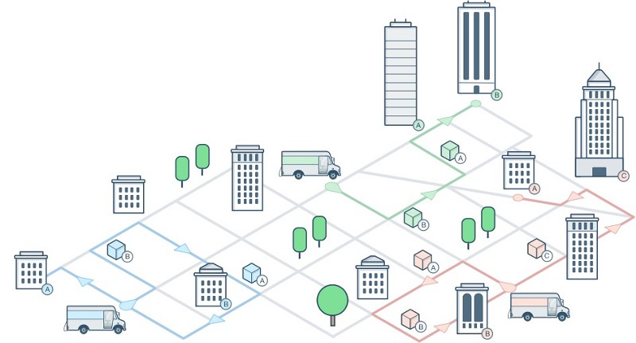
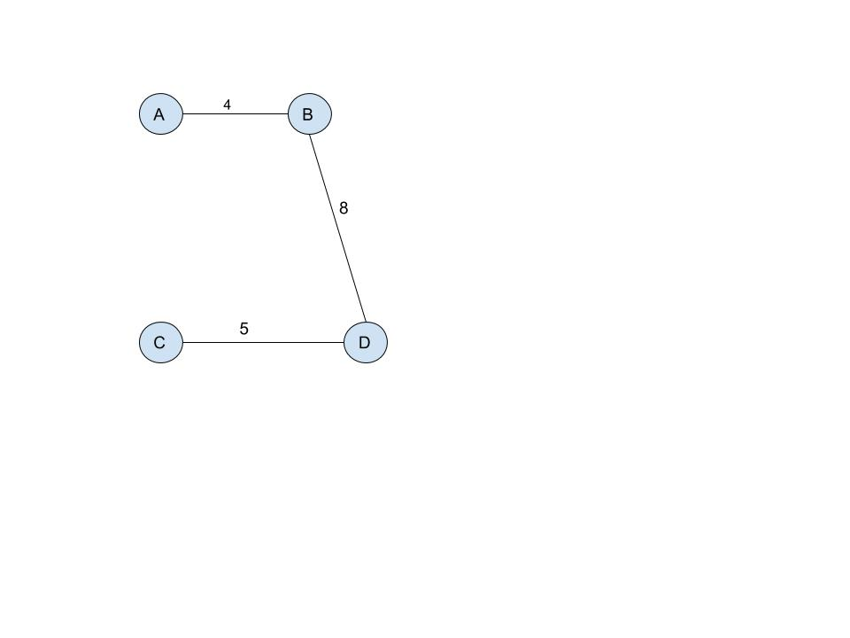
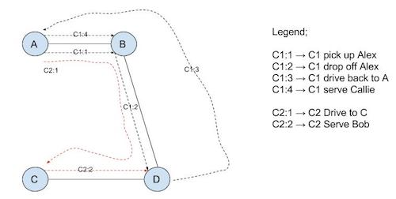
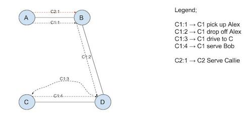

# Introduction

AAR (https://aar.pausd.org/) is an advanced academic research class in Palo Alto Unified School District.  It is a unique opportunity for students in grades 10-12 to engage in original research in an area of their choice.

In 2016-2017 school year, I had the opportunity to work with Dr Kai Zhu on studying the Vehicle Routing Problem (https://en.wikipedia.org/wiki/Vehicle_routing_problem).  VRP studies the optimal set of routes for a fleet of vehicles to traverse in order to deliver to a given set of customers.  Determiming the optimal solution is an NP-hard problem in combinatorial optimization.  In this study we designed and simulated several algorithms for a taxi dispatching problem.  Although the optimal solution will be in exponential space, we proposed a solution which is close to optimal but only consumes limited resources.

# Problem Statement

The following graph shows the problem we are studying.  In a city with a given topology road map, we need to help a transportation company with a fleet of vehicles.  Throughout the day, customers are going to call from various places in the city, they need to be picked up and sent to various desintinations in the city within certain time bound.  We need to help the transportation company to find the optimal dispatching mechanism to maximize business profit.

This is a generic vehicle routing problem with many real-world applications.  If we are transporting customers, it's a taxi dispatching problem, this is essentially building a mini-Uber.  If we are transporting packages, we are building a mini Amazon-prime delivery system.

# Studied Algorithms

All the algorithms listed below are the original work by the authors.  During the study, we designed and implemented these algorithms using computer simulation.

## Pure Greedy

The idea behind pure greedy is simple.  For each passenger call request, we will take the call and find the closest car to serve that request.  It's a simple greedy algorithm.

## Crystal Ball

We know pure greedy is quick and simple.  But it probably wouldn't yield the optimal solution.  But what is the upper bound a best algorithm can achieve?

Crystal Ball assumes that you have a crystal ball and can see all the future customer requests.  If you see all future events, you can arrange the dispatching in most optimal way.  Crystal Ball algorithm exhaustively search all the solution space and find the best dispatching.  It's an exhausitive search algorithm which runs to exponential cost easily.  Dynamic programing technique was used to minimize the search cost.

## Slacker

Between the simple *Pure Greedy* and the expensive *Cyrstal Ball*, can we have a compromised solution?  Can we find a close-to-optimal solution with a reasonable running cost?

Slacker bridges the gap by the following idea: when a customer calls, we don't have to send a car to her immmediately.  We can be a slacker, we promised the service but we procrastinate to the last minute.  How can we do that?  Because we know her travel destination and required arrival time, we know the shortest distance in the map and we know the travel time for that distance.  There is a slack buffer time before we actually need to send the car to her.  By delaying dispatching the car to her, we can wait for more customer calling in, and with more customer requesting accumulated, we can dispatch better in aggregates.

# Problem Setup and Computer Simulation

Most of the study was carried out using computer simulation.  Test data were generated first with the following attributes:
* The city's topology road map;
* Number of cars with their initial position in the map;
* A number of customer requests throughout the day with call-in time, expected arrival time, pickup site and dropoff site
* Business operational factors such as gas cost per mile, salary per driver

The above three algorithms were developed and tested using the input test dat to calculate the business profit (or loss) for the company.

Due to the time constraint, we did simple the problem in several regards (e.g. no carpooling allowed, no traffic in the roads);

## Implementation details

### Topology Map

Topology map was implemented using adjacency lists.  And since we are using a timer loop during the simulation with every minute as a time tick, in order to simplify the situation that a car ends in the middle of the road at the end of timer tick, we expanded the graph into single-unit roads.  For example, a 4-mile-long road will be expanded into 4 road links with each link a mile long, so at the end of each timer tick, the car will be at the end of a road edge.

### Shortest Distance Calculation

In order to speed up the runtime performance, the shortest distance between any two nodes in the map are pre-calculated.  Since we need to know the shortest distance between any two nodes, we decide to use Flyod-Warshall algorithm (https://en.wikipedia.org/wiki/Floyd%E2%80%93Warshall_algorithm) which is more efficient than the well-known Dijkstra's algorithm (https://en.wikipedia.org/wiki/Dijkstra%27s_algorithm) which is optimized for single starting node;

## Illustration of dispatching algorithms

We will use the following simple use case to describe the difference between the algorithms:

* Road Map:

* Two cars in the fleet: C1, C2 with initial location at site A
* Three passengers calling:

Passenger | Pickup Site | Dropoff Site | Call-in Time | Dropoff Time
--------- | ----------- | ------------ | ------------ | ------------
Alex      | A           | D            | 8:00         | 8:12
Bob       | C           | D            | 8:01         | 8:40
Callie    | A           | B            | 8:02         | 8:30

### Pure Greedy
For each request coming in we will immediately dispatch the closest car:
* For Alex's request: have car C1 pick up Alex at A, drop at D;
* For Bob's request, have car C2 drive from A to C to pick up Bob and drop him at D 
* For Callie's request, wait for C1 to become available, drive C1 from D back to A to pick up Callie

### Crystal Ball
Crystal Ball knows all the future calling events, it knows it's better to group Alex and Bob together to maximize profit
* C1 will serve Alex and Bob
* C2 will serve Callie

### Slacker
In Slacker, when Bob called, the system knows it can wait sending the car until 8:13.  By waiting it sees the new request from Callie and decide to send the car C2 to Callie instead:
* C1 will serve Alex and Bob
* C2 will serve Callie

### Observation

If you look at the travel routes by _Pure Greedy_, you can see after dropping off Alex, car 1 are doing unnecessary idle driving (back from D to A) to pick up Callie;

# Summary of Results

## Running Costs of the algorithms

Assuming there are P passengers calling in the day and there are C number of cars in the system;

Metric       | Pure Greedy | Slacker | Crystal Ball
------------ | ----------- | ------- | ------------
Running Time | P * C       | P * C * P | (P ^ C) * (P ^ C)

## Business Profit/Loss for the above example

Metric       | Pure Greedy | Slacker | Crystal Ball
------------ | ----------- | ------- | ------------
Revenue      | 42          | 42      | 28
Cost         | 52          | 42      | 28
Profit/Loss  | -10         | 14      | 14

# Future Work

The study was a rudimentary study on the vehicle routing problem, a number of simplications were introduced due to time constraint (e.g. no car-pooling, no traffic in the road system) and only three algorithms were studied.  We would like the extend the study into more algorithms and with the introduction of car-pooling.  We would also like to study the effect of using historical data to predict the future calling patterns.   

# References
